# Defect-Aware Acceleration Report for a 3D Semiconductor Inspection Pipeline

## Acknowledgements

The author would like to thank the project supervisor, research collaborators, and laboratory teammates for their guidance, technical discussions, and support during the development of this work. The author also acknowledges the use of local GPU computing resources and the project datasets and model checkpoints that made the experimental study possible.

## Abstract

This report studies defect-aware acceleration for a practical 3D semiconductor X-ray inspection workflow composed of `wp5-seg` for segmentation-model training and compression, and `intelliscan` for end-to-end raw-scan inference, metrology, reporting, and deployment. The core problem is that patch-level speed or model-level Dice does not guarantee safe whole-pipeline behavior. In this application, small segmentation changes can trigger large metrology changes and binary defect-flag flips.

To address this problem, the report adopts a **Two-Level Deployment-Safety Gate**. At Gate 1, methods are screened on the full `174`-case `wp5-seg` evaluation set. At Gate 2, retained methods are re-evaluated inside `intelliscan` with emphasis on class-sensitive drift, metrology deltas, and defect flips. Using this rule, the report identifies both retained positive results and validated negative results.

On the engineering side, combined segmentation plus metrology, report and GLTF artifact cleanup, exact quantized in-memory detection, `4`-worker CPU image preparation, and intra-view batch prefetch were all validated. On the current local eight-sample raw-scan set, the final safe default path reduces mean total runtime by `45.13%` and pooled total runtime by `44.20%` relative to the older file-based detection baseline while preserving exact outputs.

On the model side, structured pruning and class-aware knowledge distillation established a first Pareto front. Pruning ratio `0.375` is the current quality-oriented student, while `0.5` is the strongest balanced point. However, deployment experiments show that even `0.8895` full-case average Dice can still cause unacceptable downstream defect flips in the whole pipeline. Additional ablations demonstrate that context shrinkage, not the real fast path itself, is the dominant cause of adaptive-margin drift, and that larger direct padded ROI shells are also unsafe under the current model.

The main contribution of the report is therefore a defect-aware co-optimization methodology for the full 3D inspection stack, rather than a single faster network.

## Table of Contents

The formal LaTeX submission build auto-generates the full table of contents, list of figures, and list of tables. See `docs/formal_report/3ddl_acceleration_report_submission.pdf` for the submission-format version.

\newpage

# Chapter 1 Introduction

## 1.1 Motivation

Three-dimensional X-ray inspection is increasingly important for advanced semiconductor packaging, high-bandwidth memory stacks, and buried interconnect structures because many critical defects cannot be observed reliably from surface images alone. In this setting, the inspection workflow is not limited to classification or segmentation. It must also support geometry-sensitive metrology, such as bond line thickness, pad misalignment, solder extrusion, and void-related measurements. That requirement makes the acceleration problem more difficult than standard semantic segmentation. A faster model is not automatically a better deployment choice if its outputs change the downstream measurements used by engineers and inspectors.

This report studies that problem on a practical system built from two repositories. The `wp5-seg` repository provides 3D segmentation training, evaluation, pruning, finetuning, ONNX export, TensorRT build scripts, and deployment-oriented benchmarking. The `intelliscan` repository performs complete raw-scan inference through 2D multi-view detection, 3D box generation, 3D segmentation, metrology analysis, GLTF generation, and PDF reporting. The central challenge addressed in this report is that optimization opportunities exist at model, algorithm, runtime, and systems levels, but these opportunities interact. A model-level gain can be weakened or amplified by pipeline overhead. Likewise, a runtime shortcut that appears harmless at voxel level can become unacceptable after metrology thresholds are applied.

### 1.1.1 Metrology as a Cliff-Sensitive Output

The downstream metrology stage is cliff-sensitive rather than smoothly varying. In the current pipeline, defect logic is triggered after geometric quantities such as pad shift and pillar width are estimated from the predicted component masks. A simplified form of the pad-misalignment decision can be written as

$$
d_{\mathrm{misalign}} = \mathbb{1}\left(\frac{|\Delta_{\mathrm{pad}}|}{w_{\mathrm{pillar}}} > \tau_{\mathrm{pad}}\right),
\qquad \tau_{\mathrm{pad}} = 0.10
$$

where $\Delta_{\mathrm{pad}}$ is the measured pad offset and $w_{\mathrm{pillar}}$ is the local pillar width. The important point is not the exact notation, but the thresholded structure: if a segmentation boundary moves by only a few voxels, the normalized ratio can cross the decision threshold and flip the output defect flag abruptly. This explains why the present work evaluates acceleration against metrology, not against Dice alone.

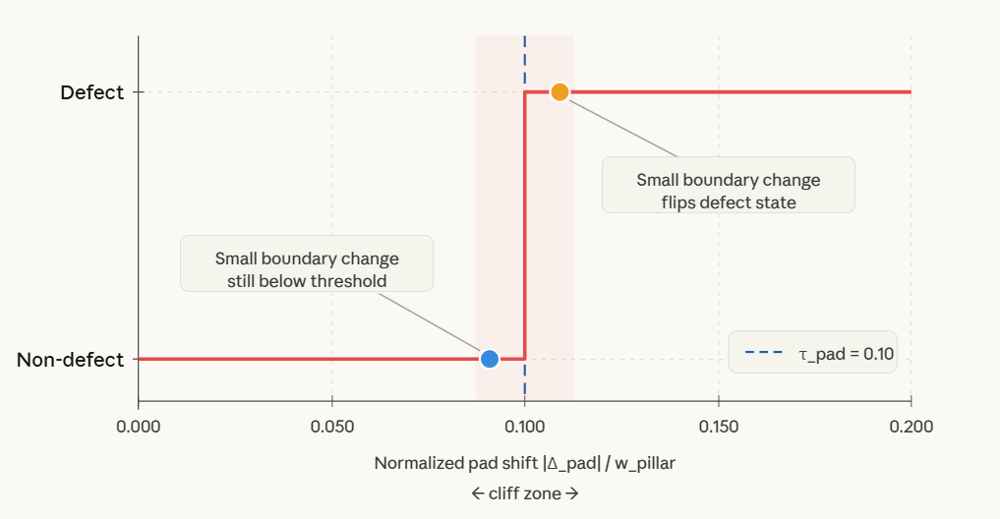

**Fig. 1.1** Conceptual cliff effect of thresholded metrology: a small normalized boundary shift can cross the decision threshold and flip the output defect state.

### 1.1.2 Industrial Deployment Challenge

Industrial semiconductor inspection differs from benchmark segmentation in two important ways. First, the deployment target is not a single neural network kernel. It is a full workflow containing data loading, 2D detection, 3D merge, 3D segmentation, measurement logic, visualization, and reporting. Second, the end users are not evaluating masks directly. They care about bump-level measurements, defect flags, and engineering traceability. This means that runtime optimization must preserve not only segmentation overlap, but also the geometric and thresholded outputs that drive inspection decisions [9,10].

The practical consequence is that standard acceleration techniques such as pruning, quantization, TensorRT deployment, and graph compilation must be re-evaluated after integration. A method that looks strong in isolated inference benchmarking can still be unsafe when it changes the class boundaries used by downstream metrology [8,11]. This deployment gap is the main reason the present work uses a whole-pipeline evaluation methodology instead of a model-only ranking.

### 1.1.3 Difference from Earlier Acceleration Studies

Many prior studies focus on one layer of the problem at a time: faster detection, faster segmentation, model compression, or runtime deployment. The present report differs in emphasis. It treats the inspection stack as a coupled system and evaluates acceleration decisions at two levels: segmentation quality on the dataset-level evaluation set, and downstream stability after whole-pipeline deployment. This is the main methodological difference between this report and more conventional “speed versus Dice” studies.

## 1.2 Problem Statement

The objective of this report is to accelerate the full 3D semiconductor inspection workflow while keeping defect-sensitive accuracy acceptable. Two concrete questions drive the work:

1. Which model-compression strategies produce a meaningful latency-size-quality tradeoff for the 3D segmentation network?
2. Which pipeline-level optimizations reduce end-to-end runtime without causing hidden drift in segmentation, defect flags, or metrology?

The report therefore does not treat acceleration as a single-stage benchmark problem. Instead, it studies the complete workflow from raw input to final engineering outputs.

## 1.3 Platform Under Study

The implementation platform consists of:

- `wp5-seg`: model training, pruning, distillation, export, and benchmark tooling.
- `intelliscan`: raw-scan processing pipeline with detection, 3D merge, segmentation, metrology, and reporting.
- Raw-scan validation set used in the current workspace: `SN002`, `SN003`, `SN008`, `SN009`, `SN010`, `SN011`, `SN012`, and `SN061`.
- Full segmentation evaluation set for compressed models: `174` test cases.
- GPU execution on local NVIDIA L40 devices.

The segmentation model is a pruned or unpruned MONAI BasicUNet-style 3D network. The detection stage uses YOLO-based 2D detection across two orthogonal scan views, followed by 3D bounding-box generation. Metrology is then computed from the predicted component masks. This structure makes the workflow particularly sensitive to small class-boundary changes.

## 1.4 Main Contributions of This Report

This report makes four main contributions.

First, it establishes a validated safe engineering acceleration path for the full `intelliscan` workflow. Combined segmentation and metrology, report reconstruction without per-bbox raw crop NIfTIs, removal of per-bbox prediction NIfTIs from the combined default path, exact quantized in-memory detection, `4`-worker CPU image preparation, and intra-view batch prefetch were all validated on local raw scans. Together, these changes produce a large end-to-end runtime reduction without changing downstream outputs on the validated set.

Second, the report builds a first model-compression Pareto front for `wp5-seg`. Structured pruning ratios `0.375`, `0.5`, and `0.625` were benchmarked and re-evaluated after full-train recovery using the same retained knowledge-distillation recipe. This establishes quality-oriented, balanced, and aggressive-speed operating points.

Third, the report shows that whole-pipeline deployment is a stricter gate than full-case Dice. Compressed students with apparently acceptable full-case recovery can still generate large defect-flag flips and metrology drift after deployment into `intelliscan`.

Fourth, the report documents several useful negative results. These include unsafe adaptive-margin behavior driven by context shrinkage, unsafe larger direct padded ROI behavior, same-GPU cross-view overlap that remains exact but slows the target stage, and several training-loss variants that do not survive full-case or whole-pipeline validation.

## 1.5 Evaluation Philosophy and the Two-Level Deployment-Safety Gate

The report adopts a two-level evaluation gate.

At the `wp5-seg` level, a method is considered promising only if it improves or preserves full-case segmentation quality on the full evaluation set. Small-slice experiments are used only for rapid screening and are not used to retain methods.

At the `intelliscan` level, a method is considered acceptable only if it preserves whole-pipeline behavior on raw scans. This means that class `3` and class `4` Dice, metrology deltas, and binary defect-flag flips matter more than background-dominated voxel agreement alone. This evaluation philosophy is one of the key findings of the report.

\newpage

# Chapter 2 Background

## 2.1 3D Segmentation and Medical-Imaging Style Networks

U-Net introduced the encoder-decoder skip-connection design that later became the foundation of many medical and volumetric segmentation systems [17]. Three-dimensional encoder-decoder networks such as 3D U-Net and V-Net extend that idea to volumetric inputs so that local context can be modeled jointly across all three axes [1,18]. More recent self-configuring frameworks such as nnU-Net further showed that much of segmentation performance comes from carefully matched preprocessing, training, and inference defaults rather than from backbone novelty alone [19]. In highly imbalanced segmentation tasks, overlap-based losses such as Generalised Dice are often preferred because minority classes can otherwise be overwhelmed by large background regions [2]. Modern healthcare-imaging toolkits such as MONAI also provide strong reusable implementations for volumetric models and inference utilities [3]. Although this report targets semiconductor inspection rather than medical imaging, the same architectural and loss-design issues arise because the data are also volumetric and class-imbalanced.

## 2.2 Model Compression and Knowledge Distillation

Structured pruning removes whole filters or channels and is more deployment-friendly than unstructured sparsity because it produces smaller dense models rather than sparse masks [4]. Channel-level pruning and slimming methods have been widely used for deployment-oriented compression because they map naturally to dense inference libraries and hardware accelerators [14,15]. Knowledge distillation transfers information from a larger teacher model to a smaller student model by matching softened teacher outputs or related signals [5]. In segmentation, however, a generic distillation loss does not always preserve the classes that matter most in downstream tasks. Boundary-aware and class-aware formulations have therefore been investigated to better preserve minority structures and class transitions [6]. This report uses those ideas as motivation, but keeps only the variants that actually survive full-case and whole-pipeline testing.

## 2.3 YOLO-Style Detection for Slice-Level Screening

The current `intelliscan` pipeline uses YOLO-style 2D object detection on two orthogonal slice views before 3D bbox merge. This choice is consistent with the broader object-detection literature, where YOLO-style detectors are widely adopted because they provide strong speed-accuracy tradeoffs and simple deployment interfaces [12,13]. In the present project, the detector is not the final output stage, but it remains critical because bbox drift propagates directly into 3D crop selection and therefore into segmentation and metrology.

## 2.4 Mixed Precision and Runtime Deployment

Automatic mixed precision is widely used to reduce memory traffic and improve training or inference efficiency on GPUs [7]. At deployment time, engines such as TensorRT can further optimize operator fusion, kernel selection, and lower-precision execution [8]. PyTorch graph compilation is another relevant runtime option because it can reduce Python overhead and improve repeated eager execution through ahead-of-time graph capture and backend lowering [11]. However, lower latency does not guarantee downstream safety, especially when the application is sensitive to small geometric changes. This report therefore treats TensorRT and `torch.compile()` as potentially valuable runtime tools, but not as methods that can be claimed safe unless defect-sensitive metrics are also preserved.

## 2.5 Semiconductor X-ray Inspection and Metrology

Recent work on semiconductor 3D X-ray analysis has already shown the value of combining detection, segmentation, and metrology in a single workflow [9]. Broader X-ray microscopy literature also emphasizes that internal electronics assessment increasingly relies on 3D imaging and automated analysis rather than surface inspection alone [10]. Related defect-analysis studies on X-ray packaging imagery also show that small visual or structural differences can have direct manufacturing relevance, which makes deployment robustness important rather than optional [20]. These references are aligned with the problem studied in this report. However, the current work differs in emphasis: instead of building a purely new detector or segmenter, the report studies how to accelerate an existing full workflow without breaking its downstream engineering outputs.

## 2.6 Why the Current Problem Is Non-Trivial

The current workflow is harder than a standard benchmark problem for three reasons.

First, the pipeline contains both model-bound and systems-bound stages. Detection image preparation, slice serialization, intermediate artifact management, and reporting can all dominate wall-clock time.

Second, the segmentation model is not the final consumer of the output. Metrology routines apply orientation logic, connected-component reasoning, thresholding, and geometric measurements. Those operations are not smooth losses; they can change abruptly when a boundary moves by only a few pixels.

Third, full-case Dice and patch latency can hide deployment risk. A compression method can appear strong in isolation and still fail after integration into the whole pipeline. This report therefore positions downstream metrology as a first-class evaluation criterion.

\newpage

# Chapter 3 Design of a Defect-Aware Acceleration Framework

## 3.1 System Overview

The acceleration framework developed in this report is built around two connected repositories. `wp5-seg` is responsible for model design, pruning, finetuning, evaluation, and deployment preparation. `intelliscan` is responsible for end-to-end raw-scan inference. The practical design principle is that the segmentation model cannot be optimized in isolation. Every candidate model or runtime shortcut must eventually be validated inside the full `intelliscan` workflow.

The overall processing chain is:

1. Load a raw 3D X-ray scan.
2. Generate two-view 2D slices for detection.
3. Detect candidate regions using YOLO-style 2D detection [12,13].
4. Merge detections into 3D bounding boxes.
5. Segment each bump region with a 3D network.
6. Compute metrology and defect flags from the predicted components.
7. Generate human-readable artifacts such as report pages and optional GLTF outputs.

This decomposition made it possible to optimize not only the segmentation model, but also the data movement and orchestration around it.

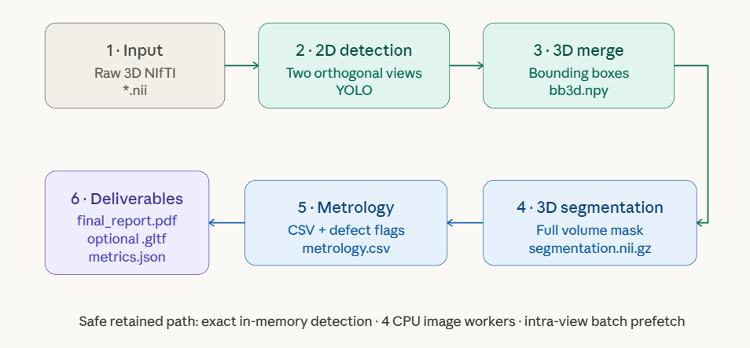

**Fig. 3.1** End-to-end artifact flow of the current `intelliscan` default pipeline.

### 3.1.1 One Concrete Demo from Input to Output

For a representative whole-pipeline example, the report uses the validated `SN002` default-path run based on one raw 3D NIfTI scan from the local raw-scan validation set and the corresponding default-path output bundle generated by `intelliscan`.

In this demo, one raw `*.nii` volume is passed through the full artifact chain and produces:

- `bb3d.npy` with `95` detected 3D bump boxes,
- `segmentation.nii.gz` as the assembled full-volume prediction,
- `metrology/metrology.csv` with `95` bump-level measurement rows,
- `metrology/final_report.pdf` as the human-readable report,
- `metrics.json` as the profiling log.

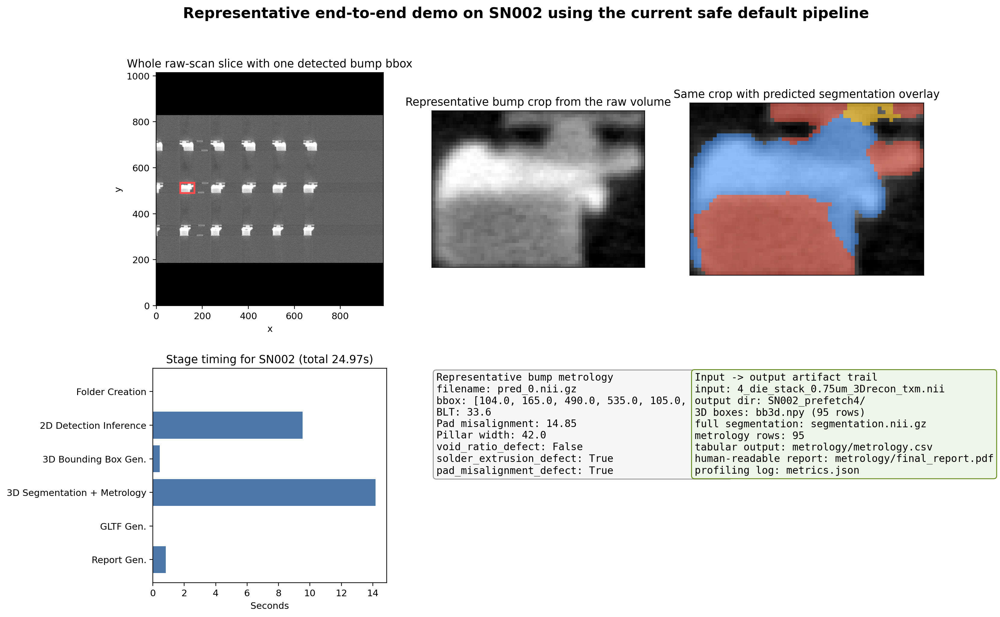

**Fig. 3.2** Representative end-to-end demo on `SN002`, showing one detected bump, the cropped region, the predicted segmentation overlay, the stage timing, and the corresponding metrology row.

## 3.2 Model-Level Design

### 3.2.1 Structured Pruning

The report explores structured pruning ratios rather than only a single pruned model. Screening experiments established that pruning ratio `0.25` was not worth continuing, while `0.375`, `0.5`, and `0.625` formed a useful first Pareto set. This design supports a more convincing report because it shows a latency-quality frontier instead of one arbitrary compressed checkpoint, which is also more aligned with deployment-oriented channel-pruning literature [4,14,15].

For a layer $l$ with original channel count $C_l$, the simplified pruning rule used in this report can be written as

$$
C'_l = \left\lfloor (1-r) C_l \right\rfloor
$$

where $r \in [0,1)$ is the pruning ratio and $C'_l$ is the retained channel count after structured channel removal. In practice, the retained widths are also constrained to remain valid BasicUNet feature sizes for the pruned checkpoint and deployment scripts, but the equation captures the central design variable used throughout the ratio sweep.

### 3.2.2 Knowledge Distillation

The retained distillation design is immediate class-aware logit distillation [5] with:

- distillation weight `0.1`
- temperature `2.0`
- class weights `1,1,1,2,2`

The supervised term and the retained class-aware distillation term are implemented as

$$
L_{\mathrm{sup}} = 0.5 L_{\mathrm{CE}} + 0.5 L_{\mathrm{Dice}}
$$

$$
L_{\mathrm{KD}} =
\frac{T^2}{\sum_i m_i \alpha_{y_i}}
\sum_i m_i \alpha_{y_i}
\operatorname{KL}
\left(
\operatorname{softmax}\left(\frac{z_t^{(i)}}{T}\right)
\;\middle\|\;
\operatorname{softmax}\left(\frac{z_s^{(i)}}{T}\right)
\right)
$$

$$
L_{\mathrm{total}} = L_{\mathrm{sup}} + \lambda_{\mathrm{KD}} L_{\mathrm{KD}}
$$

where $z_t^{(i)}$ and $z_s^{(i)}$ are teacher and student logits at voxel $i$, $m_i$ is the valid-voxel mask that removes the ignore label, $\alpha = [1,1,1,2,2]$ is the retained class-weight vector, $T = 2.0$, and $\lambda_{\mathrm{KD}} = 0.1$. This formulation matches the implemented masked KL loss used in the retained full-case student.

This configuration was not chosen by intuition alone. Several alternatives were tested and rejected:

- delayed KD did not outperform immediate KD,
- class-aware weight `1,1,1,4,2` did not remain best after full-case validation,
- feature-level attention KD did not beat the retained logit-KD baseline,
- supervised class reweighting and boundary-loss additions did not survive full-case or downstream validation.

The design implication is important: for this task, a lightweight class-aware KD term was more useful than more complex feature or auxiliary-loss variants under the tested conditions.

### 3.2.3 Full-Case and Deployment-Aware Selection

The report adds a two-stage model-selection rule. A compressed checkpoint is not kept merely because it improves patch latency. It must also:

1. preserve good full-case Dice on the `174`-case set, and
2. preserve acceptable behavior after deployment into `intelliscan`.

This led to an additional design refinement: checkpoint selection inside the same training run. Instead of using only `best.ckpt` by full-case Dice, the report introduced a checkpoint panel through the `--save-eval-checkpoints` helper and tested whether intermediate epochs behave differently in the downstream pipeline.

## 3.3 Engineering Design for Safe Pipeline Acceleration

### 3.3.1 Combined Segmentation and Metrology

The old pipeline segmented each bbox, saved per-bbox prediction NIfTIs, and then reread them during metrology. The redesigned path computes metrology directly from in-memory segmentation results while still preserving output compatibility. This design keeps segmentation geometry unchanged and only reduces redundant artifact flow.

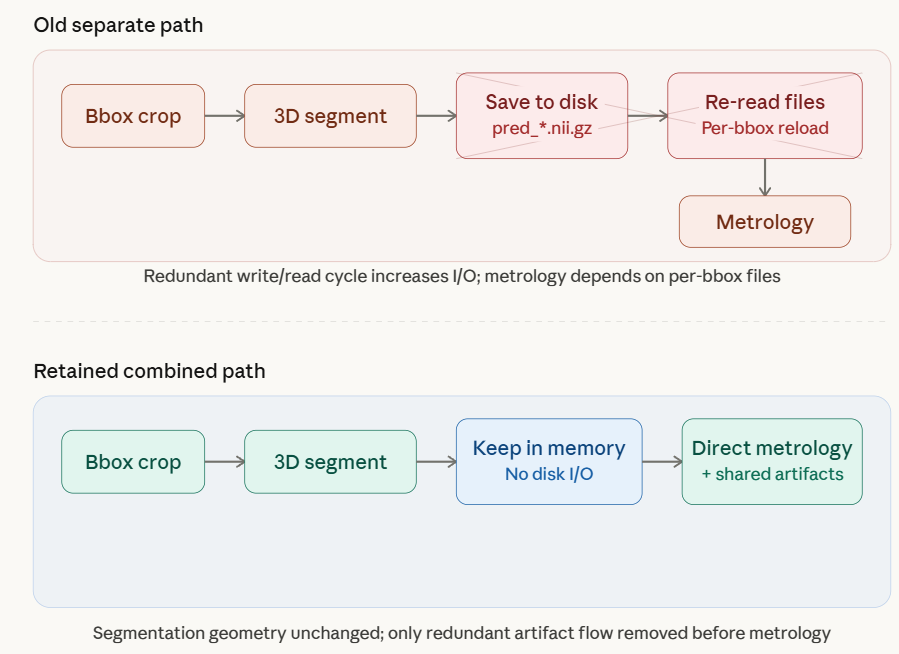

**Fig. 3.4** Old separate segmentation-to-metrology path versus the retained combined path. The redesign removes the redundant per-bbox prediction write/read cycle while leaving segmentation geometry unchanged.

### 3.3.2 Report Reconstruction Without Per-BBox Raw Crops

The report generation stage was redesigned to reconstruct visualization crops from the original input volume, the assembled segmentation volume, and a compact manifest file. This removed the need for `mmt/img/*.nii.gz` while keeping reports reproducible.

### 3.3.3 GLTF Decoupling from Per-BBox Prediction NIfTIs

After report reconstruction stopped needing `mmt/img`, GLTF export remained the last reason to keep per-bbox prediction files in the default combined path. The report therefore moved GLTF generation to an in-memory interface that consumes the already available segmentation results. This further reduced artifact clutter and stage-specific overhead.

### 3.3.4 Exact In-Memory Detection

The detection path underwent several iterations. Simply moving images into memory was not sufficient to preserve parity because the legacy path implicitly quantized detections through `.txt` serialization before 3D merge. The retained design therefore keeps the no-write detection path, but explicitly reproduces the legacy two-decimal rounding behavior before bbox merge. That design change was necessary to make in-memory detection both fast and exact.

The retained parity-preserving logic is summarized in Algorithm 3.1.

```text
Algorithm 3.1 Exact In-Memory Detection with Legacy-Equivalent Quantization
Input: raw 3D volume V, YOLO detector M
Output: merged 3D bounding boxes B_3D

1. For each detection view do
2.     Slice V into ordered 2D images
3.     Apply the same PIL transform used by the old file-based path
4.     Perform an in-memory JPEG encode/decode roundtrip
5.     Run YOLO on the decoded in-memory images
6.     Convert detections to [class_id, x1, y1, x2, y2]
7.     Quantize class_id to integer and coordinates to two decimals
8. End for
9. Merge the two quantized detection streams into 3D bounding boxes B_3D
10. Return B_3D
```

The key engineering insight is that exact parity did not come from “using memory instead of disk” alone. It came from reproducing the legacy numeric behavior at the point where 2D detections are converted into the coordinates consumed by the 3D merge stage.

### 3.3.5 CPU Preparation Parallelism and Batch Prefetch

Once detection became exact in-memory, the next bottleneck was CPU-side slice preparation. The report therefore parallelized only the per-slice CPU image-preparation step and then overlapped next-batch preparation with current YOLO inference. These optimizations were intentionally narrow so that they changed scheduling without changing numerical behavior.

## 3.4 Algorithmic Design and Causal Ablation

### 3.4.1 Adaptive Margin

Adaptive margin was originally investigated to activate more direct-path segmentation by shrinking expanded crops into the ROI. However, the report did not stop at timing results. It added factor-isolation controls to separate:

- crop/context change,
- inference-path change, and
- downstream metrology sensitivity.

This led to a clear causal finding: on clipped cases such as `SN009`, the main source of drift was context shrinkage, not the direct-padded fast path itself.

### 3.4.2 Guarded Adaptive Margin

Because full adaptive margin was unsafe, the report tested guarded candidates that only allowed limited context loss. This search showed that a narrow region such as `xy<=12`, `z<=24` could recover part of the speedup while reducing most of the drift. Even so, the best guarded candidate still produced a non-zero defect flip, so it was kept only as an experimental result rather than a default method.

### 3.4.3 Larger Direct Padded ROI

The report also tested a geometry-preserving alternative: keep the real crop unchanged, but enlarge the direct padded shell. This idea turned out to be unsafe. The experiments showed that even when the crop geometry and routing stayed almost unchanged, the larger padded input canvas could still alter predictions. This result is important because it shows that preserving bbox extent alone is not enough; the numerical behavior of the direct path also depends on the padded canvas size.

## 3.5 Two-Level Deployment-Safety Gate

The final design principle of this report is the **Two-Level Deployment-Safety Gate**. Ranking is downstream-aware rather than Dice-only. The report therefore treats whole-pipeline metrics as first-class outputs:

- class `3` Dice,
- class `4` Dice,
- pad-misalignment defect flips,
- solder-extrusion defect flips,
- BLT delta,
- pad-misalignment delta.

This ranking rule is used consistently across engineering optimizations, model deployment, and checkpoint selection.

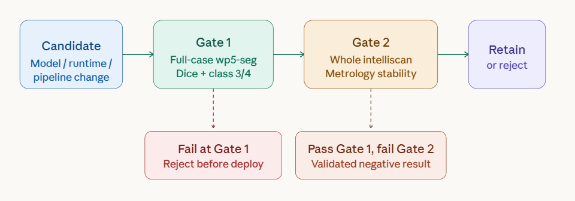

**Fig. 3.3** Two-Level Deployment-Safety Gate used throughout this report.

\newpage

# Chapter 4 Performance Evaluation

## 4.1 Experimental Setup and Metrics

The experiments in this report were carried out on local NVIDIA L40 GPUs using the `intelliscan` and `wp5-seg` environments in the current workspace. Two groups of data were used.

For model-level evaluation, the compressed segmentation models were tested on the full `174`-case evaluation set used by `wp5-seg`.

For pipeline-level evaluation, raw scans from `SN002`, `SN003`, `SN008`, `SN009`, `SN010`, `SN011`, `SN012`, and `SN061` were used, depending on the experiment.

The most important metrics in this report are:

- average Dice on the full segmentation test set,
- class `3` and class `4` Dice,
- end-to-end runtime,
- stage runtime,
- defect-flag flips,
- BLT and pad-misalignment deltas.

This report intentionally does not rely on voxel agreement alone when judging acceptability.

### 4.1.1 Runtime Repeatability Note

Where possible, repeated stage-only or patch-level benchmarks were used to reduce noise when comparing narrow runtime changes. Examples include direct-ROI timing probes, compile-mode selection, and isolated detection-stage scheduling studies. However, the whole-pipeline runtime-candidate ranking introduced later in this chapter is based on single sequential raw-scan runs per sample and backend, because each full raw-scan experiment is substantially more expensive. The variance analysis in this report is therefore partial rather than complete, and a larger repeated-run study remains future work.

## 4.2 Baseline Profiling of the Whole Pipeline

Table 4.1 summarizes a validated formal benchmark on `SN009` using the current PyTorch baseline, the earlier `--inmemory` variant, and the current TensorRT FP16 run.

**Table 4.1 Baseline and accelerated formal benchmark on SN009**

| Variant | Total (s) | NII->JPG (s) | Detection (s) | BBox (s) | Segmentation (s) | Metrology (s) | Report (s) |
| --- | ---: | ---: | ---: | ---: | ---: | ---: | ---: |
| PyTorch baseline | `93.23` | `24.43` | `14.85` | `2.15` | `33.79` | `16.95` | `1.05` |
| earlier `--inmemory` | `89.86` | `3.51` | `16.49` | `1.88` | `49.58` | `17.47` | `0.93` |
| TRT FP16 | `81.15` | `22.73` | `13.91` | `2.14` | `24.15` | `16.79` | `1.42` |

Two observations follow immediately. First, the pipeline is not dominated by one stage only. Second, segmentation is still a major cost on difficult scans, but file conversion, detection, and surrounding orchestration are also large enough to justify engineering optimization.

The earlier `--inmemory` row in Table 4.1 should be read as a historical exploratory point rather than as a retained design. It reduced front-end file conversion but predated the later safe engineering cleanup around combined segmentation plus metrology and report/artifact refactoring. For that reason, it did not yet translate into a better segmentation-stage result on `SN009`, and it is included here mainly to show that speed gains had to be pursued as a coordinated pipeline effort rather than as a single isolated toggle.

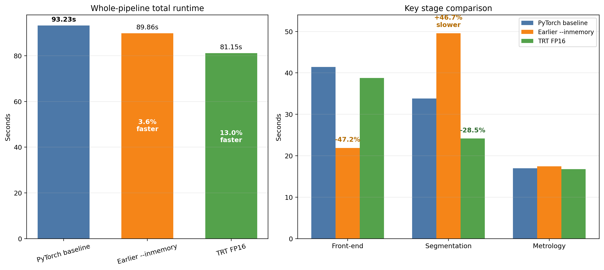

**Fig. 4.1** Formal `SN009` stage breakdown across the baseline, earlier exploratory `--inmemory` run, and TRT FP16.

## 4.3 Safe Engineering Optimizations

### 4.3.1 Combined Segmentation and Metrology

**Table 4.2 Combined segmentation and metrology stage comparison**

| Sample | Separate Seg+Met (s) | Combined Seg+Met (s) | Relative Gain |
| --- | ---: | ---: | ---: |
| `SN009` | `64.41` | `47.64` | `26.04%` |
| `SN002` | `17.97` | `17.62` | `1.99%` |

The combined path preserved identical `segmentation.nii.gz` on the validated samples and corrected an existing legacy `bb`-mapping issue. This makes it a safe retained optimization rather than a risky shortcut.

### 4.3.2 Report and Artifact Cleanup

**Table 4.3 Report-memory-reuse result after removing `mmt/img` dependency**

| Sample | Old Total (s) | New Total (s) | Old Report (s) | New Report (s) | Output Parity |
| --- | ---: | ---: | ---: | ---: | --- |
| `SN002` | `55.02` | `54.38` | `0.86` | `0.81` | exact |
| `SN009` | `86.99` | `81.15` | `0.92` | `0.81` | exact |

**Table 4.4 No-`mmt/pred` GLTF stage benchmark**

| Sample | Save `mmt/pred` (s) | No `mmt/pred` (s) | Relative Gain |
| --- | ---: | ---: | ---: |
| `SN002` | `7.8960` | `7.2006` | `8.81%` |
| `SN009` | `35.4865` | `33.5964` | `5.33%` |

These results show that engineering cleanup is not merely cosmetic. Removing unnecessary intermediate artifacts can reduce the target stage while keeping outputs unchanged.

### 4.3.3 Detection-Stage Acceleration

The detection line evolved in three validated steps:

1. exact quantized in-memory detection became the default,
2. CPU-side slice preparation was parallelized with `4` workers,
3. intra-view batch prefetch was added.

**Table 4.5 Quantized in-memory detection against the older file-based detection baseline**

| Metric | Value |
| --- | ---: |
| validated raw scans | `8` |
| exact samples | `8 / 8` |
| mean total speedup | `22.49%` |
| pooled total speedup | `21.99%` |
| mean front-end speedup | `35.30%` |
| pooled front-end speedup | `35.31%` |

**Table 4.6 Current safe default path after worker parallelism and batch prefetch**

| Metric | Value |
| --- | ---: |
| mean total reduction vs older file-based detection baseline | `45.13%` |
| pooled total reduction vs older file-based detection baseline | `44.20%` |
| mean detection-stage reduction | `26.59%` |
| pooled detection-stage reduction | `26.61%` |

Representative sample-level gains from the final default path are:

- `SN002`: `54.01s -> 24.97s`
- `SN003`: `57.00s -> 30.48s`
- `SN009`: `75.22s -> 48.15s`
- `SN012`: `74.26s -> 46.98s`

These are among the strongest validated engineering results in the whole project because they are both exact and multi-sample.

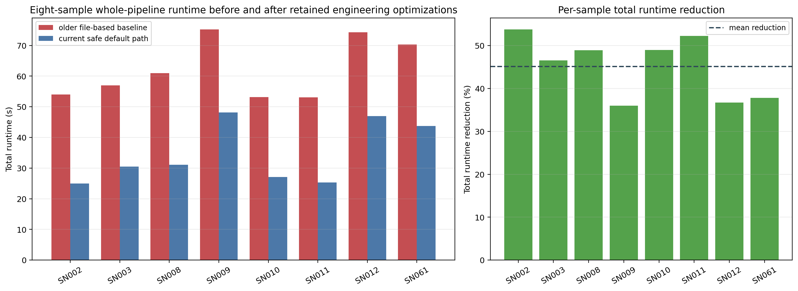

**Fig. 4.2** Eight-sample whole-pipeline reduction of the retained engineering path relative to the older file-based detection baseline.

## 4.4 Algorithmic and Runtime Findings

### 4.4.1 TRT FP16 Is Faster but Not Yet Safe

**Table 4.7 TensorRT FP16 speed gain and quality risk on SN009**

| Metric | Value |
| --- | ---: |
| baseline total runtime | `93.23s` |
| TRT FP16 total runtime | `81.15s` |
| baseline segmentation time | `33.79s` |
| TRT FP16 segmentation time | `24.15s` |
| voxel accuracy | `0.989006` |
| class 3 Dice | `0.192758` |
| class 4 Dice | `0.422984` |
| pad defect flips | `67` |
| solder defect flips | `12` |

This result is speed-positive but not defect-safe. It is therefore useful as a runtime reference, but not yet suitable for a deployment claim.
This behavior is consistent with the broader deployment warning in the TensorRT literature: lower backend latency does not automatically imply safe downstream behavior when the application is threshold-sensitive [8,16].

### 4.4.2 Adaptive Margin: Causal Ablation

**Table 4.8 Factor-isolation ablation on adaptive margin**

| Sample | Key Finding |
| --- | --- |
| `SN009` | context-only drift (`A vs C`) is already close to full adaptive drift (`A vs D`) |
| `SN009` | context-only vs full adaptive (`C vs D`) is nearly identical |
| `SN002` | direct-padded vs sliding-window under the same crop is near-identical and defect-stable |

This is one of the strongest algorithmic findings in the report. It shows that the real risk in adaptive margin is context shrinkage, not the production fast path itself.

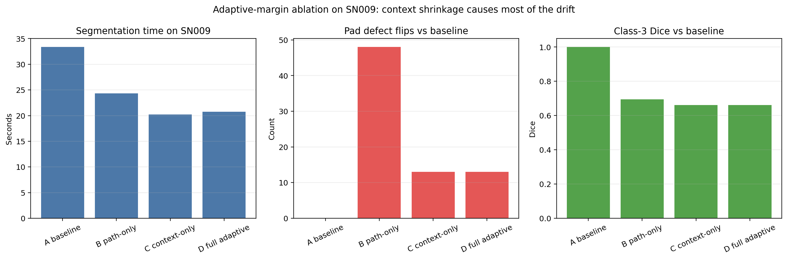

**Fig. 4.3** Adaptive-margin ablation on `SN009`, showing that context shrinkage reproduces most of the observed drift.

### 4.4.3 Guarded Adaptive Margin

The guarded search recovered a partial speedup, but not a fully safe default.

**Table 4.9 Best guarded adaptive candidate on SN009**

| Variant | Segmentation Time (s) | Direct Crops | Dice c3 | Dice c4 | Pad Flips | Solder Flips |
| --- | ---: | ---: | ---: | ---: | ---: | ---: |
| baseline | `37.71` | `0` | reference | reference | `0` | `0` |
| full adaptive | `22.29` | `113` | `0.6618` | `0.8094` | `13/114` | `5/114` |
| guarded `G5` | `31.13` | `28` | `0.9318` | `0.9560` | `1/114` | `0/114` |

Although `G5` is much safer than full adaptive, it still produces a non-zero defect flip on `SN009`. It therefore remains experimental.

### 4.4.4 Larger Direct Padded ROI

**Table 4.10 Larger direct padded ROI is not a safe or worthwhile default optimization**

| Sample | Variant | Key Outcome |
| --- | --- | --- |
| `SN010` | `roi118` | same direct/sliding count as baseline, but `5` pad flips and `21` solder flips |
| `SN010` | `roi124` | slightly more direct crops, no meaningful speedup, stronger drift |
| `SN002` | `roi124` | class-4 Dice `0.3860`, `36 / 95` solder flips despite unchanged real crop |

This negative result is important for the final report because it shows that changing the padded direct-path canvas alone can alter outputs materially.

### 4.4.5 Negative Scheduling Result

Same-GPU cross-view detection overlap was also tested. It stayed exact, but the repeated detection-only benchmark showed it was slower on both benchmarked samples. This line was therefore dropped.

## 4.5 Model Compression Results

### 4.5.1 Pruning Pareto Front

**Table 4.11 Pruning ratio Pareto ranking**

| Ratio | Parameters | Reduction | FP32 Patch Latency (ms) | Speedup vs Teacher | Avg Dice | Class 3 | Class 4 | Gap vs Teacher |
| --- | ---: | ---: | ---: | ---: | ---: | ---: | ---: | ---: |
| `0.375` | `2,247,285` | `60.91%` | `15.28` | `1.14x` | `0.89513` | `0.78690` | `0.87169` | `-0.01025` |
| `0.5` | `1,438,853` | `74.97%` | `6.39` | `2.72x` | `0.88953` | `0.75450` | `0.87494` | `-0.01586` |
| `0.625` | `809,909` | `85.91%` | `5.00` | `3.47x` | `0.88210` | `0.74877` | `0.86175` | `-0.02328` |

This table establishes the first model-compression Pareto front in the project. Ratio `0.375` is the current quality-oriented point, ratio `0.5` is the strongest balanced point, and ratio `0.625` is the aggressive-speed point.
The associated Pareto visualization in Fig. 4.4 makes the same tradeoff easier to read by plotting latency against full-case Dice while keeping class `3` and class `4` visible in the underlying table.

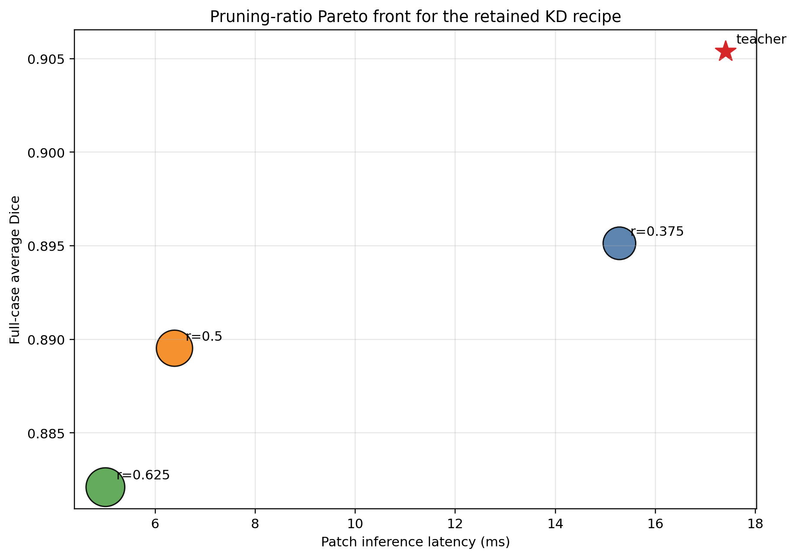

**Fig. 4.4** Pruning-ratio Pareto front for the retained KD recipe.

### 4.5.2 Knowledge Distillation Findings

Small-scale experiments first showed that class-aware KD was promising. Full-case evaluation then refined the decision.

**Table 4.12 Full-case recovery ranking for the retained `0.5` student**

| Variant | Avg Dice | Class 3 | Class 4 |
| --- | ---: | ---: | ---: |
| teacher | `0.9054` | `0.7937` | `0.8966` |
| full-train plain | `0.8785` | `0.7122` | `0.8707` |
| full-train class-aware KD `1,1,1,2,2` | `0.8895` | `0.7545` | `0.8749` |

This is a real positive result. The retained class-aware KD configuration improves average Dice, class `3`, and class `4` relative to plain full-train finetuning.

An earlier internal repo note also reported stronger patch-level TensorRT deployment gains for some compression settings. However, those historical raw artifacts were not revalidated in the current workspace pass, so they are not used as primary evidence in this report.

### 4.5.3 Rejected Model-Level Variants

The report also rejected several candidates after testing:

- delayed KD,
- feature-level attention KD,
- supervised class reweighting,
- boundary-loss augmentation as a retained method.

These negative results are useful because they narrow the report story to methods that actually survived the evaluation gate.

## 4.6 Deployment of Compressed Students into the Whole Pipeline

### 4.6.1 Direct Student Deployment

**Table 4.13 Whole-pipeline deployment of compressed students against the teacher**

| Sample | Variant | Total Runtime (s) | Seg+Met (s) | Dice c3 | Dice c4 | Pad Flips | Solder Flips | BLT Mean Delta |
| --- | --- | ---: | ---: | ---: | ---: | ---: | ---: | ---: |
| `SN002` | `r=0.375` | `25.03` | `13.94` | `0.2867` | `0.0548` | `16/95` | `50/95` | `7.21` |
| `SN002` | `r=0.5` | `24.16` | `13.03` | `0.0622` | `0.1284` | `2/95` | `65/95` | `2.71` |
| `SN009` | `r=0.375` | `46.37` | `34.12` | `0.5007` | `0.5045` | `32/114` | `14/114` | `1.61` |
| `SN009` | `r=0.5` | `41.11` | `28.37` | `0.0630` | `0.5570` | `63/114` | `22/114` | `2.03` |

This table explains why model compression cannot be judged only by full-case Dice. The speed gains are real, but the downstream cost is too high for direct retention. In an inspection setting where defect and metrology decisions are thresholded, these flip counts matter more than a small average-overlap improvement [9,10].

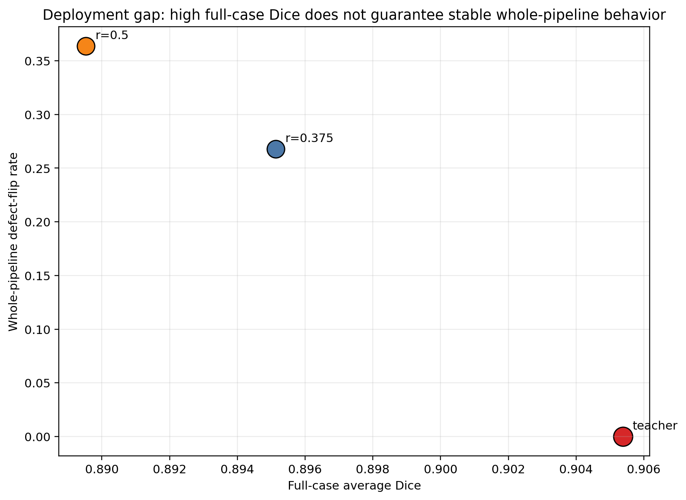

**Fig. 4.5** Deployment gap between full-case average Dice and whole-pipeline defect-flip behavior.

### 4.6.2 Deployment-Aware Checkpoint Selection

The report then tested whether different checkpoints from the same retained run behave differently after deployment.

For `SN010`, the two student checkpoints were launched concurrently on the same GPU. The quality and metrology comparisons remain valid, but runtime from that sample is not used as primary timing evidence in this section.

**Table 4.14 Deployment-aware checkpoint selection**

| Sample | Candidate | Dice c3 | Dice c4 | Pad Flips | Solder Flips | BLT Mean Delta |
| --- | --- | ---: | ---: | ---: | ---: | ---: |
| `SN002` | old `last.ckpt` | `0.4760` | `0.1416` | `1/95` | `35/95` | `3.8168` |
| `SN002` | panel `epoch_005` | `0.5861` | `0.1277` | `0/95` | `32/95` | `2.6232` |
| `SN009` | old `last.ckpt` | `0.0051` | `0.5310` | `55/114` | `13/114` | `1.0500` |
| `SN009` | panel `epoch_005` | `0.3026` | `0.5928` | `58/114` | `23/114` | `0.8842` |
| `SN010` | old `last.ckpt` | `0.8043` | `0.2709` | `8/110` | `51/110` | `4.7218` |
| `SN010` | panel `epoch_005` | `0.8292` | `0.2519` | `6/110` | `53/110` | `4.1491` |

This result establishes another important report finding. Whole-pipeline checkpoint ranking is real, but even the best current candidate, `epoch_005`, is still not cleanly deployment-safe across all samples and metrics.

### 4.6.3 Whole-Pipeline Runtime Candidate Ranking

The compressed students were then combined with the retained runtime candidates from the backend study and re-evaluated inside the full `intelliscan` workflow. This ranking is stricter than a patch-level benchmark because it includes detection, 3D merge, segmentation, metrology, and reporting.

**Table 4.15 Whole-pipeline ranking of retained runtime candidates and related baselines**

| Variant | Status | Full-case Avg Dice | Full-case c3 | Full-case c4 | Patch Infer (ms) | Mean Total (s) | Mean Seg+Met (s) | Total Runtime Change vs Teacher | Mean Energy (J) | Mean Power (W) | Whole-pipeline c3 vs Teacher | Whole-pipeline c4 vs Teacher | Pad Flips | Solder Flips | BLT Mean Delta |
| --- | --- | ---: | ---: | ---: | ---: | ---: | ---: | ---: | ---: | ---: | ---: | ---: | ---: | ---: | ---: |
| teacher / eager | reference | `0.905383` | `0.793697` | `0.896560` | `17.40` | `34.96` | `22.09` | `0.00%` | `4945.14` | `108.06` | - | - | - | - | - |
| `r=0.375` / eager | context-only | `0.895134` | `0.786901` | `0.871692` | `16.47` | `33.38` | `21.35` | `4.53%` | `4833.24` | `109.47` | `0.5391` | `0.2690` | `52` | `117` | `4.5204` |
| `r=0.375` / TRT FP16 | retained | `0.895146` | `0.786925` | `0.871728` | `3.15` | `30.41` | `17.97` | `13.02%` | `3745.68` | `91.46` | `0.5389` | `0.2690` | `52` | `117` | `4.5204` |
| `r=0.375` / TRT INT8 fit-only | validated with caveat | `0.892145` | `0.773414` | `0.870663` | `2.79` | `29.57` | `17.64` | `15.41%` | `3667.74` | `91.41` | `0.4649` | `0.2695` | `50` | `116` | `4.6191` |
| `r=0.5` / eager | context-only | `0.889527` | `0.754505` | `0.874937` | `8.87` | `30.39` | `18.62` | `13.08%` | `3815.77` | `94.80` | `0.2159` | `0.3049` | `70` | `140` | `3.1774` |
| `r=0.5` / compile | retained fallback / caveat | `0.889527*` | `0.754505*` | `0.874937*` | `4.80` | `50.16` | `37.54` | `-43.49%` | `5524.06` | `90.78` | `0.2159` | `0.3049` | `70` | `140` | `3.1774` |
| `r=0.5` / TRT FP16 | retained | `0.889533` | `0.754498` | `0.874958` | `1.62` | `29.45` | `17.29` | `15.78%` | `3498.51` | `87.65` | `0.2158` | `0.3049` | `71` | `141` | `3.1774` |

`*` The `r=0.5 / compile` row uses the same student checkpoint as `r=0.5 / eager`. A separate full-case compile rerun was not performed, so the full-case columns report the checkpoint-level model metrics rather than a compile-specific full-case evaluation. On the tested three-sample raw-scan panel, compile and eager were numerically near-identical in downstream quality.

In Table 4.15, positive percentages indicate speedup and negative percentages indicate slowdown relative to the teacher. This table adds three important conclusions to the report. First, `r=0.5 / TRT FP16` is the fastest retained runtime candidate and also the lowest-energy retained runtime candidate on the current three-sample whole-pipeline panel. Second, `r=0.375 / TRT FP16` remains the cleaner quality-oriented runtime choice among the retained compressed deployments. Third, `r=0.5 / compile` is a good patch-level or repeated-inference fallback backend [11], but it is a negative result for the present single-scan CLI workflow because the compile warmup cost dominates end-to-end latency.

Just as importantly, the teacher-relative whole-pipeline quality columns barely change inside each student family when the backend changes from eager to compile or TensorRT FP16. This means backend optimization does not solve the deployment drift of the compressed student by itself.

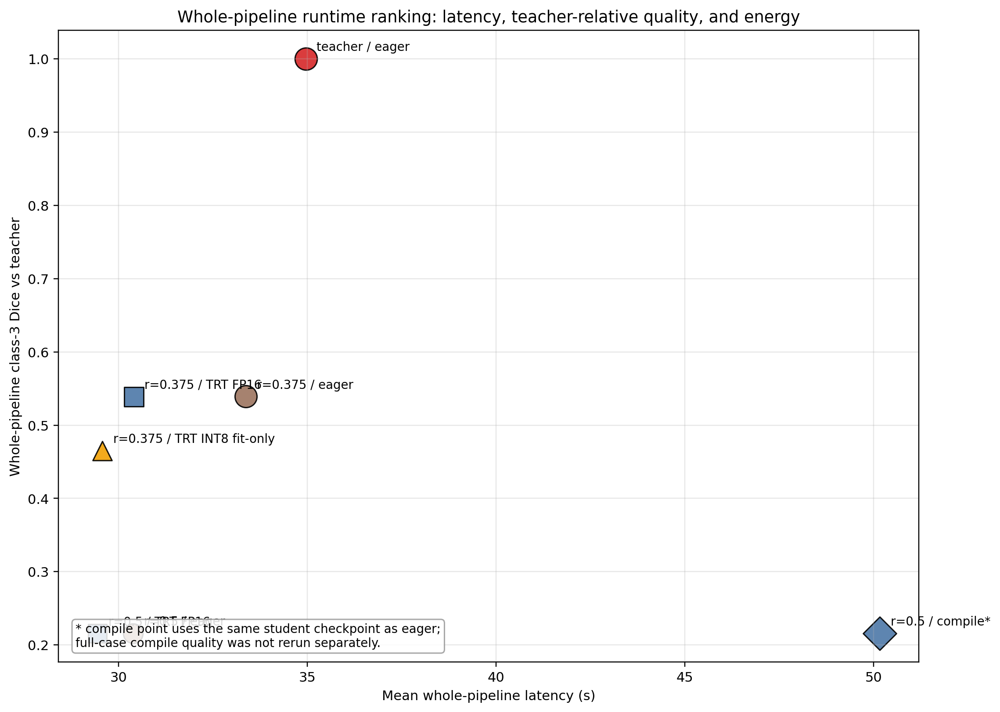

**Fig. 4.6** Whole-pipeline runtime-quality-energy ranking derived from the candidate table. Marker area is proportional to mean whole-pipeline energy.

### 4.6.4 Case Study: Good Full-Case Dice, Bad Pipeline Behavior

The `r=0.5` student provides the clearest deployment-gap example. At model level, it looks strong: its full-case average Dice is `0.889527`, with class `3 = 0.754505` and class `4 = 0.874937` on the full `174`-case evaluation set. However, once this student is inserted into the whole raw-scan pipeline, the downstream picture changes sharply.

On `SN002`, the `r=0.5` eager deployment produces `65 / 95` solder-extrusion defect flips relative to the teacher. On `SN009`, the same student produces `63 / 114` pad-misalignment defect flips. The backend does not rescue this behavior: the compile and TRT FP16 rows remain numerically near-identical to the eager row on the tested panel. This case study demonstrates the main methodological claim of the report: high full-case Dice is necessary, but not sufficient, for deployment into a thresholded metrology workflow.

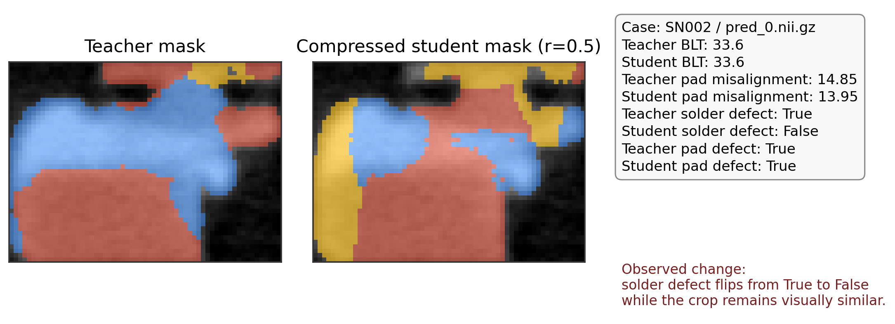

**Fig. 4.7** Representative deployment-gap case on `SN002`, where the compressed student changes the predicted component layout and downstream defect state despite a visually similar crop.

## 4.7 Synthesis of Effective and Ineffective Directions

The final outcome of the performance evaluation can be summarized as follows.

Effective and retained:

- combined segmentation and metrology,
- report reconstruction without per-bbox raw crop NIfTIs,
- GLTF decoupling from per-bbox prediction NIfTIs,
- exact quantized in-memory detection,
- `4`-worker CPU image preparation,
- intra-view batch prefetch,
- pruning-ratio Pareto analysis,
- class-aware immediate KD with full-case validation,
- deployment-aware checkpoint panel selection as an analysis method.

Measured but not retained as deployment-safe:

- TRT FP16 for defect-sensitive deployment,
- whole-pipeline `r=0.5 / compile` as a current single-scan backend,
- adaptive margin as a default optimization,
- guarded adaptive margin as a default optimization,
- larger direct padded ROI,
- direct deployment of current compressed students,
- same-GPU cross-view overlap,
- generic feature KD,
- delayed KD,
- supervised reweighting,
- boundary-loss augmentation as a retained method.

## 4.8 Visual Summary

The figures included in this chapter serve different purposes rather than duplicating the same message. Figures 4.1 and 4.2 document the retained engineering gains. Figure 4.3 provides the causal ablation needed to explain why one tempting segmentation-speed idea had to be rejected. Figures 4.4, 4.5, 4.6, and 4.7 document the model-level and whole-pipeline tradeoffs that define the deployment gap. Together, these figures convert the report from a table-only summary into a deployment-oriented experimental narrative.

\newpage

# Chapter 5 Conclusions

## 5.1 What Has Been Done

In summary, this report contributes a defect-aware acceleration methodology for a practical 3D semiconductor inspection workflow, achieving large retained engineering speedups while showing why several superficially attractive shortcuts remain unsafe after deployment. The study covered model-level compression, algorithmic ablation, runtime behavior, and pipeline engineering. The work did not stop at patch-level speed or segmentation overlap. Instead, it evaluated every important decision against the whole `intelliscan` workflow whenever possible.

At the engineering level, the report validated a sequence of safe optimizations that significantly reduce runtime while preserving exact outputs on the local validated raw-scan set. The strongest result is the final safe default front-end path, which combines exact quantized in-memory detection, CPU image-preparation parallelism, and intra-view batch prefetch. Relative to the older file-based detection baseline, this path reduces mean total runtime by `45.13%` and pooled total runtime by `44.20%` on eight validated raw scans.

At the model level, the report established a first pruning Pareto front and identified a retained class-aware KD recipe that improves compressed-student recovery over plain finetuning on the full `174`-case evaluation set. At runtime level, the report completed a retained backend ranking for the current compressed students. `r=0.5 / TRT FP16` is the strongest retained speed-and-energy runtime point, while `r=0.375 / TRT FP16` is the stronger quality-oriented retained runtime point. At the algorithmic level, the report also produced causal evidence explaining why some faster segmentation policies are unsafe. In particular, adaptive-margin drift was shown to be dominated by context shrinkage, while larger direct padded ROI experiments showed that the padded input canvas itself can change predictions.

The report also documented a critical deployment lesson: good full-case Dice does not guarantee good downstream metrology. This is one of the most important outcomes of the work and directly supports the whole-pipeline-first evaluation philosophy adopted in the project.

## 5.2 What Has Not Been Done

Several important items remain unfinished.

First, no compressed student has yet cleared the full whole-pipeline deployment gate strongly enough to replace the teacher model in `intelliscan`. Even the best current checkpoint-panel candidate improves some downstream metrics while remaining mixed on others.

Second, no compressed student plus runtime backend pair is yet deployment-safe enough to replace the teacher inside the current metrology-sensitive workflow. Backend ranking is now complete enough for the present students, but the dominant drift source remains the student model rather than the backend choice.

Third, `torch.compile(reduce-overhead)` is useful as a PyTorch fallback backend in `wp5-seg`, but it is not a good current single-scan `intelliscan` backend because cold-start compile time overwhelms the steady-state patch-level gain in the present CLI workflow.

Fourth, the current workspace does not yet provide a fully validated real-data INT8 calibration and QAT story for the compressed students. The necessary deployment direction has been identified, but it is not yet complete enough to be retained as a main report contribution.

Fifth, actual GLTF output generation still needs one final recheck in a PyVista-enabled environment, although the artifact-dependency cleanup itself is already validated.

## 5.3 Extensions and Future Work

If more time were available, the next extensions should follow the same defect-aware logic rather than a speed-first logic.

The first extension should be downstream-aware model selection or training. The current checkpoint-panel study already shows that checkpoint ranking changes after deployment. A stronger next step would be to incorporate a small raw-scan validation panel directly into checkpoint selection or early stopping.

The second extension should be real-data TensorRT deployment of the best retained student. This should begin with FP16 and then move to PTQ or QAT only after real calibration data are prepared. However, no deployment claim should be made unless class-sensitive and metrology-sensitive stability are preserved.

The third extension should be a stronger geometry-preserving runtime design. The negative results in this report have already shown which directions are not promising. Future work should therefore avoid context trimming and avoid naive larger-padding shells unless the direct path is retrained or explicitly aligned.

Finally, this report can be extended into a publication-quality study by turning the current validated tables into a unified latency-versus-quality framework, where model size, average Dice, class `3`, class `4`, defect flips, and metrology deltas are reported together rather than in isolation.

\newpage

# References

[1] Ö. Çiçek, A. Abdulkadir, S. S. Lienkamp, T. Brox, and O. Ronneberger, “3D U-Net: Learning Dense Volumetric Segmentation from Sparse Annotation,” in *MICCAI*, 2016. arXiv:1606.06650. https://arxiv.org/abs/1606.06650

[2] C. H. Sudre, W. Li, T. Vercauteren, S. Ourselin, and M. J. Cardoso, “Generalised Dice Overlap as a Deep Learning Loss Function for Highly Unbalanced Segmentations,” in *DLMIA / ML-CDS*, 2017. https://link.springer.com/chapter/10.1007/978-3-319-67558-9_28

[3] M. J. Cardoso et al., “MONAI: An Open-Source Framework for Deep Learning in Healthcare,” 2022. https://arxiv.org/abs/2211.02701

[4] H. Li, A. Kadav, I. Durdanovic, H. Samet, and H. P. Graf, “Pruning Filters for Efficient ConvNets,” in *ICLR*, 2017. arXiv:1608.08710. https://arxiv.org/abs/1608.08710

[5] G. Hinton, O. Vinyals, and J. Dean, “Distilling the Knowledge in a Neural Network,” 2015. arXiv:1503.02531. https://arxiv.org/abs/1503.02531

[6] H. Kervadec, J. Dolz, M. Tang, E. Granger, Y. Boykov, and I. Ben Ayed, “Boundary Loss for Highly Unbalanced Segmentation,” in *MIDL*, 2019. https://proceedings.mlr.press/v102/kervadec19a.html

[7] PyTorch, “Automatic Mixed Precision Package,” official documentation. https://pytorch.org/docs/stable/amp.html

[8] NVIDIA, “TensorRT Developer Guide: Working with Quantized Types,” official documentation. https://docs.nvidia.com/deeplearning/tensorrt/latest/inference-library/work-quantized-types.html

[9] J. Wang, R. Chang, Z. Zhao, and R. S. Pahwa, “Robust Detection, Segmentation, and Metrology of High Bandwidth Memory 3D Scans Using an Improved Semi-Supervised Deep Learning Approach,” *Sensors*, vol. 23, no. 12, 2023. https://www.mdpi.com/1424-8220/23/12/5470

[10] J. Villarraga-Gómez et al., “Assessing Electronics with Advanced 3D X-ray Imaging Techniques, Nanoscale Tomography, and Deep Learning,” *Journal of Failure Analysis and Prevention*, 2024. https://link.springer.com/article/10.1007/s11668-024-01989-5

[11] PyTorch, “`torch.compile` End-to-End Tutorial,” official documentation. https://pytorch.org/tutorials/intermediate/torch_compile_tutorial.html

[12] J. Redmon, S. Divvala, R. Girshick, and A. Farhadi, “You Only Look Once: Unified, Real-Time Object Detection,” in *CVPR*, 2016. https://arxiv.org/abs/1506.02640

[13] A. Bochkovskiy, C.-Y. Wang, and H.-Y. M. Liao, “YOLOv4: Optimal Speed and Accuracy of Object Detection,” 2020. https://arxiv.org/abs/2004.10934

[14] Z. Liu, J. Li, Z. Shen, G. Huang, S. Yan, and C. Zhang, “Learning Efficient Convolutional Networks through Network Slimming,” in *ICCV*, 2017. https://arxiv.org/abs/1708.06519

[15] Y. He, J. Lin, Z. Liu, H. Wang, L.-J. Li, and S. Han, “AMC: AutoML for Model Compression and Acceleration on Mobile Devices,” in *ECCV*, 2018. https://arxiv.org/abs/1802.03494

[16] NVIDIA, “TensorRT Best Practices,” official documentation. https://docs.nvidia.com/deeplearning/tensorrt/latest/performance/best-practices.html

[17] O. Ronneberger, P. Fischer, and T. Brox, “U-Net: Convolutional Networks for Biomedical Image Segmentation,” in *MICCAI*, 2015. https://arxiv.org/abs/1505.04597

[18] F. Milletari, N. Navab, and S.-A. Ahmadi, “V-Net: Fully Convolutional Neural Networks for Volumetric Medical Image Segmentation,” in *3DV*, 2016. https://arxiv.org/abs/1606.04797

[19] F. Isensee, P. F. Jaeger, S. A. A. Kohl, J. Petersen, and K. H. Maier-Hein, “nnU-Net: a self-configuring method for deep learning-based biomedical image segmentation,” *Nature Methods*, vol. 18, pp. 203-211, 2021. https://www.nature.com/articles/s41592-020-01008-z

[20] M. Abtahi, T. Le-Vu, and A. P. A. Fischer, “Classification of Wire Bonding Defects in X-ray Images Using Deep Learning,” *Journal of Imaging*, vol. 9, no. 10, 2023. https://www.mdpi.com/2313-433X/9/10/214

\newpage

# Publications from this Report

At the time of writing, no publication has yet been submitted, accepted, or published from this report.
